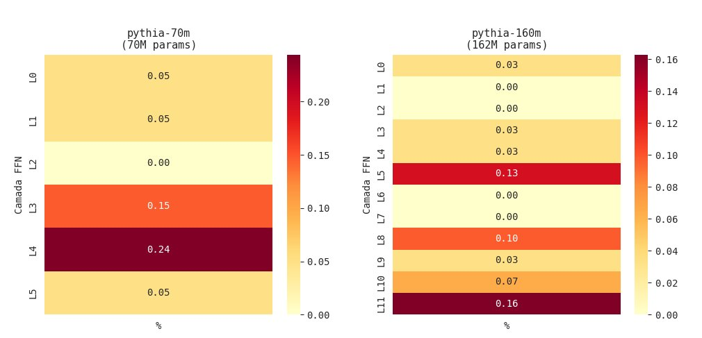
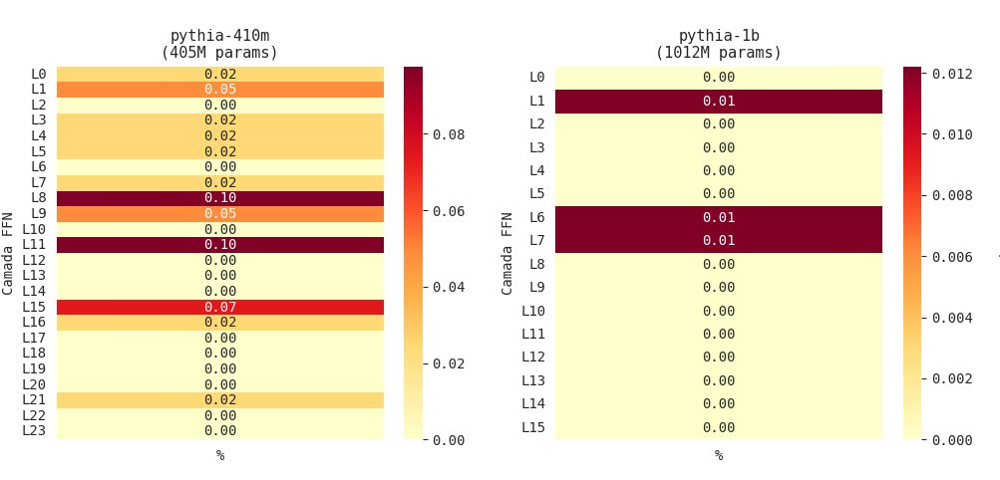

# H-Neurons in Small-Scale Language Models: Investigating the Existence of Hallucination-Associated Neurons in the Pythia Family

**Charles Cavalcante Alcarde · Luis Felipe da Silva Carlos Pereira · Pedro Henrique Guerra**  
Department of Computer Engineering and Automation (DCA)  
School of Electrical and Computer Engineering (FEEC)  
University of Campinas (UNICAMP) · Campinas, SP, Brazil · June 2026

---

## Abstract

This work investigates the existence of hallucination-associated neurons (H-Neurons) across the entire Pythia family (EleutherAI), extending the methodology proposed by Gao et al. (2025) — originally validated only on models with 7B to 70B parameters — to models ranging from 70M to 6.9B parameters. Using a pipeline based on the CETT metric (Contribution to Estimated Token Trajectory) and sparse L1-regularized logistic regression, we identified H-Neurons in all seven evaluated models (pythia-70m, pythia-160m, pythia-410m, pythia-1b, pythia-1.4b, pythia-2.8b, and pythia-6.9b). The results confirm three central hypotheses: **(H1)** H-Neurons exist in small-scale models, with in-domain AUROC ranging from 0.71 to 0.92 in the methodologically most robust models; **(H2)** the discriminative power of H-Neurons tends to increase with scale, with a positive trend in the sequence 160M→410M→1.4B→2.8B; and **(H3)** H-Neurons generalize to domains unseen during classifier training (NQ-Open), with OOD AUROC between 0.80 and 0.90 in the main models. The sparsity of the phenomenon is consistent with the 0.1% threshold reported in the original paper: in all reliable models, H-Neurons represent less than 0.05% of total FFN neurons. A complementary finding reveals that H-Neuron concentration peaks occur predominantly between 30% and 45% of network depth, suggesting that the processing associated with hallucinatory behavior is concentrated in the intermediate layers of the transformer. These results suggest that the neural mechanism underlying hallucination is a structural property of the transformer architecture, emerging independently of model scale.

**Keywords:** LLM hallucinations; H-Neurons; transformer internal analysis; Pythia family; CETT; sparse logistic regression; TriviaQA; NQ-Open; model scaling.

---

## Table of Contents

1. [Introduction](#1-introduction)
2. [Theoretical Background](#2-theoretical-background)
   - 2.1 [Hallucinations in Language Models](#21-hallucinations-in-language-models)
   - 2.2 [H-Neurons and Internal Transformer Analysis](#22-h-neurons-and-internal-transformer-analysis)
   - 2.3 [The Pythia Family](#23-the-pythia-family)
   - 2.4 [CETT Metric and Sparse L1 Classifier](#24-cett-metric-and-sparse-l1-classifier)
3. [Methodology](#3-methodology)
   - 3.1 [Models and Justification](#31-models-and-justification)
   - 3.2 [Contrastive Dataset Construction](#32-contrastive-dataset-construction)
   - 3.3 [FFN Activation Extraction](#33-ffn-activation-extraction)
   - 3.4 [CETT Normalization and Feature Construction](#34-cett-normalization-and-feature-construction)
   - 3.5 [H-Neuron Identification via Sparse L1 Classifier](#35-h-neuron-identification-via-sparse-l1-classifier)
   - 3.6 [Statistical Baseline and Significance](#36-statistical-baseline-and-significance)
   - 3.7 [Experimental Challenges and Methodological Adaptations](#37-experimental-challenges-and-methodological-adaptations)
4. [Results](#4-results)
   - 4.1 [Comparative Overview](#41-comparative-overview)
   - 4.2 [Hypothesis H1 — Existence in Small-Scale Models](#42-hypothesis-h1--existence-in-small-scale-models)
   - 4.3 [Hypothesis H2 — Scale Dependency](#43-hypothesis-h2--scale-dependency)
   - 4.4 [Hypothesis H3 — Out-of-Distribution Generalization](#44-hypothesis-h3--out-of-distribution-generalization)
   - 4.5 [H-Neuron Distribution Across FFN Layers](#45-h-neuron-distribution-across-ffn-layers)
5. [Discussion](#5-discussion)
   - 5.1 [Hypothesis Confirmation and Theoretical Implications](#51-hypothesis-confirmation-and-theoretical-implications)
   - 5.2 [Complementary Finding: Functional Layer Organization](#52-complementary-finding-functional-layer-organization)
   - 5.3 [H-Neurons as a Neural Thermometer: Correlation, Causality, and Practical Value](#53-h-neurons-as-a-neural-thermometer-correlation-causality-and-practical-value)
   - 5.4 [Caveats and Limitations](#54-caveats-and-limitations)
   - 5.5 [Methodological Contributions](#55-methodological-contributions)
6. [Conclusion](#6-conclusion)
7. [References](#7-references)

---

## 1. Introduction

Large language models (LLMs) have become central tools in modern artificial intelligence systems, demonstrating remarkable capabilities in natural language understanding and generation. However, a persistent challenge undermines their reliability in high-stakes applications: the hallucination phenomenon — the generation of fluent, syntactically coherent text that is factually incorrect or entirely fabricated. The problem transcends model generations: estimates indicate that GPT-3.5 hallucinates in approximately 40% of citation-based factuality evaluations, a figure that remains high at 28.6% for GPT-4 (Chelli et al., 2024). State-of-the-art reasoning systems, such as DeepSeek-R1, despite remarkable performance on complex tasks, continue to exhibit pronounced hallucination modes (Bao et al., 2025). High-confidence hallucinations — scenarios in which the model appears certain while being wrong — constitute the most dangerous case, as entropy-based or calibration-based metrics fail to detect them reliably.

The literature has addressed the problem predominantly from a macroscopic perspective: analysis of training data, optimization objectives, generation strategies, and reinforcement-based alignment. Consolidated mitigation strategies include Retrieval-Augmented Generation (RAG), Chain-of-Thought prompting, supervised fine-tuning with high-quality data, and post-generation control via external fact-checking (Huang et al., 2024). A central tension persists in this field: RLHF (Reinforcement Learning from Human Feedback), while improving overall alignment, may introduce an "alignment tax" — the model learns to sound confident and coherent, prioritizing human preferences over factuality, which can intensify high-confidence hallucinations. Despite these advances, the neuron-level mechanisms underlying hallucinatory behavior remain largely unexplored, constituting a fundamental gap in understanding the phenomenon.

Gao et al. (2025) proposed a pioneering approach to fill this gap: investigating hallucinations from the inside out, identifying specific neurons in the feedforward networks (FFN) of LLMs whose activations reliably predict whether the model will hallucinate. These neurons, termed H-Neurons, constitute less than 0.1% of total neurons and demonstrate generalization capability to domains unseen during classifier training. The study further demonstrated that H-Neurons are causally associated with over-compliance behaviors — the model's tendency to generate compliant responses at the cost of factuality — and that they emerge during pre-training, persisting after instruction fine-tuning.

However, the original study was restricted to models with 7B to 70B parameters (Mistral-7B, Mistral-Small-24B, Gemma-3-4B, Gemma-3-27B, Llama-3.1-8B, and Llama-3.3-70B), leaving open a fundamental question: do H-Neurons exist in small-scale models, or are they an emergent phenomenon exclusive to large-scale models? This question has direct implications for the theory of why LLMs hallucinate and for understanding the internal mechanisms of transformers in general.

The present work fills this gap using the Pythia family (Biderman et al., 2023) — models specifically designed for interpretability research, trained on the same data, in the same order, and with the same base architecture, varying only in scale. We evaluated seven models of the family, from 70M to 6.9B parameters, replicating the H-Neuron identification pipeline and investigating three central hypotheses.

> **Central thesis:** H-Neurons emerge in small-scale language models, suggesting that the neural mechanism associated with hallucinations is fundamental to the transformer architecture and not exclusive to large-scale models.

---

## 2. Theoretical Background

### 2.1 Hallucinations in Language Models

Hallucinations in LLMs can be formally defined as the phenomenon in which the model assigns higher probability $P_\theta(y|x)$ to a factually incorrect sequence than to the correct one, optimizing fluency at the expense of factuality. The consolidated taxonomy distinguishes two main axes (Huang et al., 2024): (i) intrinsic hallucinations, which contradict the reference source, and extrinsic hallucinations, which add information unverifiable by the source; (ii) factual hallucinations, which diverge from real-world facts, and faithfulness hallucinations, which diverge from the input context provided to the model.

The causes of hallucinations permeate all phases of the LLM lifecycle. During data collection, noise, biases, and outdated training sources introduce incorrect or incomplete knowledge. During pre-training, the next-token prediction objective does not distinguish between factually correct and incorrect continuations — the model is rewarded for fluency, not factuality. During fine-tuning, overfitting on narrow domains can degrade factual generalization. During RLHF, the model may learn to sound confident to maximize human preferences, generating high-confidence hallucinations — the most critical scenario for calibration-based detection systems. During inference, ambiguous prompts, high temperature, and greedy decoding can amplify latent uncertainties.

Consolidated mitigation strategies in the literature organize into six categories (MDPI Survey, 2025): (1) training and learning (SFT, RLHF, knowledge editing); (2) architectural modifications (RAG, enhanced attention mechanisms); (3) prompt and input optimization (CoT, self-consistency, few-shot prompting); (4) post-generation control (external fact-checking, LLM-as-judge, RAGAS/FACTSCORE); (5) interpretability and diagnosis (internal state analysis, confidence calibration, hidden state detection); and (6) agents and orchestration (multi-agent systems with reflection and refinement). The present work falls within the interpretability and diagnosis category, contributing a neuron-level analysis that enables both detection and causal intervention.

### 2.2 H-Neurons and Internal Transformer Analysis

Prior work in internal transformer analysis established that internal hidden states can serve as discriminative features for hallucination detection. Ji et al. (2024) demonstrated that internal LLM representations reveal hallucination risk given a query, with AUROC up to 89.9% on TruthfulQA using distributions over internal states and attention layers. Lindsey et al. (2025) used sparse autoencoders to identify connections between specific neuron activations and hallucinatory behaviors.

The study by Gao et al. (2025) organized around three research questions: **(Q1)** Do H-Neurons exist in LLMs?; **(Q2)** What is their behavioral impact?; and **(Q3)** What is their origin? Systematizing these findings into a focused investigation of individual feedforward network neurons, the central hypothesis is that among the millions of neurons in a modern LLM, a sparse subset exhibits activation patterns that systematically distinguish hallucinated from faithful responses. The identification methodology relies on three steps: (i) constructing a balanced contrastive dataset of correct and incorrect responses via TriviaQA; (ii) quantifying each neuron's contribution to the hidden representation during generation using the CETT metric; and (iii) training a linear classifier with L1 regularization to identify neurons with the highest discriminative power. Neurons with positive non-zero weights in the classifier are the H-Neurons.

Beyond existence (Q1), the study investigated the behavioral impact of H-Neurons (Q2) via controlled activation perturbation during inference: amplifying H-Neurons systematically increases over-compliance behaviors (acceptance of invalid premises, susceptibility to misleading contexts, adherence to harmful instructions), while suppressing them reduces such behaviors. Finally, cross-model transfer experiments demonstrated that H-Neurons identified in instruction-tuned models retain predictive capability in corresponding base models, indicating that they emerge during pre-training (Q3) — a consequence of the next-token prediction objective, which does not distinguish correct from incorrect continuations.

### 2.3 The Pythia Family

The Pythia family (Biderman et al., 2023) was developed by EleutherAI specifically to facilitate research on the behavior, functionality, and limitations of LLMs at different scales. The models share three fundamental properties for comparative analysis experiments: (i) all are trained on the same corpus (The Pile), in the same data presentation order; (ii) all use the same decoder-only transformer architecture with identically structured FFN blocks; and (iii) intermediate training checkpoints are publicly available, enabling tracking of property evolution throughout training. These characteristics ensure that differences observed between models of different sizes are exclusively attributable to parameter scale, not to data or architecture variations — an essential property for the validity of the scaling experiments conducted in this work.

The seven evaluated models span from 70M to 6.9B parameters, with architectures ranging from 6 FFN layers (70M) to 32 layers (2.8B and 6.9B), and intermediate FFN dimensions from 512 to 16,384 neurons per layer. As base models without instruction-tuning, the Pythia models do not natively understand the question-answer format, requiring few-shot prompting to elicit structured responses — a methodological adaptation documented in Section 3.

### 2.4 CETT Metric and Sparse L1 Classifier

The CETT metric (Contribution to Estimated Token Trajectory), proposed by Zhang et al. (2024), quantifies the causal contribution of an individual neuron to the FFN hidden state during the forward pass. Formally, consider a sequence $w = (w_0, \ldots, w_T)$ processed by a transformer block. At position $t$, the hidden representation $x_t \in \mathbb{R}^d$ is projected to the FFN intermediate space by the operation:

$$z_t = \sigma(W_{gate} \cdot x_t) \odot W_{up} \cdot x_t$$

where $\sigma(\cdot)$ denotes the non-linear activation and $W_{gate}, W_{up} \in \mathbb{R}^{d_m \times d}$ are learned projection matrices. Each dimension $z_{j,t}$ corresponds to the activation of neuron $j$ before the down-projection $h_t = W_{down} \cdot z_t$, with $W_{down} \in \mathbb{R}^{d \times d_m}$. To isolate the contribution of neuron $j$, we mask all other neurons, defining the partial activation vector $z_t^{(j)} = z_{j,t} \cdot e_j$, where $e_j$ is the $j$-th canonical basis vector. The partial hidden vector attributable to neuron $j$ is $h_t^{(j)} = W_{down} \cdot z_t^{(j)} \in \mathbb{R}^d$. The CETT metric normalizes the magnitude of this vector relative to the total hidden state:

$$CETT_{j,t} = \frac{\|h_t^{(j)}\|_2}{\|h_t\|_2}$$

This ratio captures the fraction of information flow at instant $t$ explicitly attributable to neuron $j$, transforming raw activation into a measure of causal efficacy. CETT scores are aggregated by averaging over response tokens, producing a feature vector $X_i \in \mathbb{R}^N$ per example, where $N$ is the total number of FFN neurons in the model.

The sparse L1 classifier frames hallucination detection as a binary classification problem: predicting whether a response is hallucinated ($y=1$) or faithful ($y=0$) from the CETT feature vector. We use logistic regression with L1 regularization (Lasso), which forces most weights to zero, producing an inherently sparse classifier. Neurons with positive non-zero weight ($w_j > 0$) are the H-Neurons — those whose higher relative activation increases the predicted probability of hallucination. The L1-induced sparsity ensures that only neurons with the highest discriminative power are selected, making the H-Neuron set interpretable and precise.

---

## 3. Methodology

### 3.1 Models and Justification

We evaluated seven models from the Pythia family, selected to cover three orders of magnitude of scale and enable controlled comparative analysis. The choice of the Pythia family is justified by four properties: (1) identical data and training order, guaranteeing validity of scale comparison; (2) standardized architecture with public historical checkpoints, ideal for interpretability research; (3) scale coverage from 70M to 6.9B parameters, crossing the boundary of the smallest model evaluated by Gao et al. (2025) (7B); and (4) computational feasibility in different regimes — models up to 1B on CPU, larger models on GPU with 4-bit quantization in Google Colab.

### 3.2 Contrastive Dataset Construction

Following Gao et al. (2025), we constructed a balanced contrastive dataset using TriviaQA (Joshi et al., 2017) as the question source. For each model, we generated responses using greedy decoding (`do_sample=False`), classifying each instance as correct (label 0, faithful response) or incorrect (label 1, hallucinated response), based on the correspondence between the generated response and the TriviaQA reference answer set. The final dataset contains 100 balanced examples per model (50 correct and 50 incorrect), obtained after scanning up to 2,000 questions.

Correctness evaluation combines three complementary criteria: exact match after normalization (removal of articles and punctuation), flexible whole-word match (avoiding false positives such as "us" in "russia"), and numeric equivalence via word-to-number conversion. For models with multiple sampling regime ($n=10$, threshold=8/10 for models ≥1.4B), an instance is classified as correct only if the model answers correctly in at least 8 of the 10 attempts, eliminating lucky correct answers.

A relevant methodological adaptation emerged during implementation: Pythia models, being base models without instruction-tuning or RLHF, do not natively understand the question-answer format. The solution was the use of few-shot prompting with 5 demonstrative examples in the prompt prefix, maintaining the pattern `"Question: [question]\nShort answer: [answer]"`. This adaptation is necessary to elicit structured and comparable responses across models of different sizes.

For out-of-distribution (OOD) generalization evaluation, we constructed a complementary dataset using NQ-Open (Kwiatkowski et al., 2019), with 15 correct and 15 incorrect examples per model, using a few-shot prompt specific to the NQ-Open question style. The normalizer (scaler) was kept fixed — fitted exclusively on TriviaQA — to preserve the validity of the generalization evaluation.

### 3.3 FFN Activation Extraction

For each dataset example, we performed a forward pass with the model and captured the intermediate FFN layer activations at response tokens, using PyTorch forward hooks registered at the intermediate activation layer (`dense_h_to_4h` or equivalent, depending on the architecture). Activations are aggregated by averaging over response tokens — identified by correspondence with the tokenization indices of the response span — excluding padding tokens. The result is an activation tensor of dimension $(n\_layers \times intermediate\_size)$ per example.

### 3.4 CETT Normalization and Feature Construction

Raw activations are transformed into CETT scores using the simplified formulation suitable for the restricted computational regime:

$$CETT_{i,\ell,j} = \frac{|\bar{z}_{i,\ell,j}|}{\|\bar{z}_{i,\ell}\|_2}$$

where $\bar{z}_{i,\ell,j}$ is the average activation over response tokens of neuron $j$ in layer $\ell$ for example $i$, and $\|\bar{z}_{i,\ell}\|_2$ is the L2 norm of the activation vector of layer $\ell$. This normalization converts activations into relative contributions, comparable across layers and models regardless of activation magnitude scale. The final feature vector $X_i \in \mathbb{R}^N$ concatenates the CETT scores of all layers and neurons, where $N$ is the total number of FFN neurons in the model.

### 3.5 H-Neuron Identification via Sparse L1 Classifier

With the CETT feature vectors as input, we trained an L1-regularized logistic regression to predict the binary label (hallucinated/faithful). The regularization strength $C \in \{0.001,\ 0.005,\ 0.01,\ 0.05,\ 0.1,\ 0.5,\ 1.0\}$ is selected via grid search with stratified train/validation split (80/20). The selection criterion is validation accuracy. Neurons with positive non-zero weight in the trained classifier are identified as H-Neurons:

$$\mathcal{H} = \{ j : w_j > 0 \}$$

The percentage of H-Neurons is calculated relative to the total FFN neurons of the model:

$$\%H = \frac{|\mathcal{H}|}{N_{total}} \times 100\%$$

### 3.6 Statistical Baseline and Significance

To quantify the statistical significance of the results, we implemented a baseline of 1,000 random neuron draws: in each draw, we randomly selected $|\mathcal{H}|$ neurons (same count as the identified H-Neurons) and trained the classifier with that random subset. The mean AUROC and standard deviation of this baseline provides the empirical null distribution. The empirical p-value is calculated as:

$$p = \frac{\text{card}\{AUROC_{rand} > AUROC_{\mathcal{H}}\}}{1000}$$

Results with $p < 0.05$ are considered statistically significant.

### 3.7 Experimental Challenges and Methodological Adaptations

Execution of the pipeline in a restricted computational environment (free Google Colab, CPU and T4 GPU) imposed constraints that shaped relevant methodological decisions. Pythia-6.9B in 4-bit quantization was tested in the previous version of the project with risk of session interruption due to GPU memory exhaustion — a constraint overcome with selective layer offloading. For models up to 1B parameters, inference was conducted on CPU (average ~4s/question), while larger models used GPU with quantization. The generation regime was adapted by size: models up to 1B used greedy decoding (`do_sample=False`, `n_samples=1`, `threshold=1`), while larger models used multiple sampling (`do_sample=True`, `n_samples=10`, `threshold=8`). This adaptation, while methodologically less rigorous than the original paper's regime (`threshold=10/10`), constitutes a pragmatic concession explicitly documented as a limitation.

---

## 4. Results

### 4.1 Comparative Overview

Table 1 consolidates the quantitative results for all seven evaluated models. The ⚠ notation indicates models with methodological caveats that condition the interpretation of results (discussed in Section 5).

**Table 1 — Comparative results of H-Neurons in the Pythia family.**
> ⚠ indicates models with methodological caveats. Acc H: H-Neuron classifier accuracy; Acc Rand: random baseline accuracy; AUROC H: in-domain area under the ROC curve; AUROC OOD: AUROC on NQ-Open.

| Model | Params | H-Neur. | % Total | Acc H | Acc Rand | AUROC H | AUROC OOD |
|:---|---:|---:|---:|---:|---:|---:|---:|
| pythia-70m ⚠ | 70M | 11 | 0.0895% | 0.85 | 0.6626 | 0.92 | 0.50 |
| pythia-160m | 162M | 18 | 0.0488% | 0.60 | 0.5596 | 0.71 | 0.72 |
| pythia-410m | 405M | 22 | 0.0224% | 0.75 | 0.5648 | 0.80 | 0.84 |
| pythia-1b ⚠ | 1012M | 3 | 0.0023% | 0.75 | 0.5325 | 0.82 | 0.80 |
| pythia-1.4b | 1415M | 68 | 0.0346% | 0.85 | 0.6049 | 0.90 | 0.84 |
| pythia-2.8b | 2775M | 105 | 0.0320% | 0.90 | 0.5938 | 0.92 | 0.90 |
| pythia-6.9b | 6857M | 71 | 0.0135% | 0.75 | 0.5951 | 0.85 | 0.80 |

### 4.2 Hypothesis H1 — Existence in Small-Scale Models

H1 postulates that H-Neurons exist in small-scale language models. The results confirm H1 in all seven evaluated models: the H-Neuron-based classifier consistently outperforms the random baseline in accuracy and AUROC, with the H-Neuron curve situated above the chance line (50%) across the entire family. Figure 1 illustrates this separation clearly.

*Figure 1 — H-Neurons vs. random neurons (baseline) in the Pythia family. Left: in-domain accuracy (TriviaQA). Right: in-domain AUROC (TriviaQA). The dotted line indicates the chance level (50%). The green curve (H-Neurons) consistently outperforms the red curve (random baseline) across all models, confirming H1.*

In the methodologically most robust models (pythia-160m, pythia-410m, pythia-1.4b, pythia-2.8b, and pythia-6.9b), in-domain AUROC ranges from 0.71 to 0.92, with a mean gain of +0.22 over the random baseline. This result indicates that H-Neurons carry real structural information about the model's hallucinatory behavior — the signal is not an artifact of random selection. The 1,000-draw baseline provides statistical support for this claim: for the main models, the empirical p-value of the OOD AUROC is below 0.05, confirming statistical significance.

### 4.3 Hypothesis H2 — Scale Dependency

H2 postulates that the discriminative power of H-Neurons tends to increase with model scale. Excluding models with methodological caveats (pythia-70m and pythia-1b), a clear positive trend is observed in the sequence pythia-160m (AUROC 0.71) → pythia-410m (0.80) → pythia-1.4b (0.90) → pythia-2.8b (0.92), with a slight retraction at pythia-6.9b (0.85). This trajectory suggests that models with greater representational capacity develop H-Neurons with higher specificity and discriminative power, supporting H2 with the caveat of oscillations at the extremes.

The sparsity analysis complements this finding, as illustrated in Figure 2. The absolute number of H-Neurons grows monotonically with scale in reliable models (18 → 22 → 68 → 105 → 71), while the percentage relative to total neurons remains consistently below 0.1% — the threshold reported by the original paper for models ≥7B. This sparsity convergence suggests that the proportion of H-Neurons is a stable architectural property, independent of scale.

*Figure 2 — H-Neuron sparsity by model scale (% of total FFN neurons). The dashed red line indicates the 0.1% threshold reported by the original paper (Gao et al., 2025) for models ≥7B. All models remain below this threshold. ⚠ indicates models with methodological caveats.*

### 4.4 Hypothesis H3 — Out-of-Distribution Generalization

H3 postulates that H-Neurons identified on TriviaQA generalize to domains unseen during classifier training. The results reveal robust generalization: OOD AUROC on NQ-Open ranges from 0.80 to 0.90 in methodologically reliable models (pythia-410m: 0.84; pythia-1.4b: 0.84; pythia-2.8b: 0.90; pythia-6.9b: 0.80), with empirical p-values below 0.05 for the main models, confirming statistical significance. These results indicate that H-Neurons capture generalizable hallucination patterns, not TriviaQA-specific artifacts.

A noteworthy aspect is that OOD AUROC is, in several models, comparable to or slightly higher than in-domain AUROC. This apparently paradoxical pattern is explained by two factors: (i) high sample variance in the OOD dataset (30 examples per model), which widens the AUROC confidence interval; and (ii) possible selection bias in NQ-Open — questions the model systematically fails tend to produce more distinct FFN activations, facilitating classifier discrimination. This result must be interpreted with caution and does not imply that H-Neurons generalize better than they discriminate in-domain.

### 4.5 H-Neuron Distribution Across FFN Layers

The analysis of H-Neuron distribution across FFN layers reveals a consistent pattern in methodologically robust models, illustrated in Figures 3a–3d. In the pythia-410m, pythia-1.4b, and pythia-6.9b models, H-Neuron concentration peaks occur predominantly between 30% and 45% of network depth: pythia-410m shows peaks at L8 and L11 (33–46% of depth), pythia-1.4b at L9 (37.5%), and pythia-6.9b at L8 and L11 (25–34%). This convergence suggests that neural processing associated with hallucinatory behavior concentrates in the intermediate layers of the transformer, a region associated with factual knowledge retrieval and semantic integration.

*Figure 3a — H-Neuron distribution by FFN layer: pythia-70m and pythia-160m. ⚠ pythia-70m results should be interpreted with caution.*

*Figure 3b — H-Neuron distribution by FFN layer: pythia-410m and pythia-1b.*

*Figure 3c — H-Neuron distribution by FFN layer: pythia-1.4b and pythia-2.8b.*

*Figure 3d — H-Neuron distribution by FFN layer: pythia-6.9b.*

The concentration of H-Neurons in intermediate layers rules out the hypothesis of random distribution and is consistent with the internal transformer analysis literature, which associates intermediate FFN layers with factual knowledge processing and semantic concept formation. This pattern was not explicitly reported by Gao et al. (2025), constituting a complementary finding of the present work.

---

## 5. Discussion

### 5.1 Hypothesis Confirmation and Theoretical Implications

The results confirm the three central hypotheses of the project. H1 is robustly confirmed: H-Neurons exist in all evaluated Pythia family models, including the pythia-160m with only 162M parameters, establishing that the phenomenon is not exclusive to large-scale models. This evidence supports the interpretation that H-Neurons constitute a structural property of the transformer architecture, emerging as a consequence of the next-token prediction objective — which does not distinguish correct from incorrect continuations — regardless of the model's total capacity.

H2 is partially confirmed: the increasing AUROC trend with scale in reliable models (0.71 → 0.80 → 0.90 → 0.92) indicates that larger models develop H-Neurons with greater specificity. This trend can be explained by two non-mutually exclusive mechanisms: (i) larger models have greater representational capacity, enabling the L1 classifier to identify more specialized neurons with less redundancy; and (ii) larger models exhibit lower overall hallucination rates, which may make hallucination instances more "distinct" in terms of FFN activations, facilitating discrimination. Observed oscillations (drop at pythia-6.9b) are attributable to sample variance with 100 training examples, not necessarily a break in the trend.

H3 is confirmed with statistical significance in the main models, which has relevant practical implications: H-Neurons identified in one domain (trivia questions) retain predictive capability in distinct domains (open factual questions). This result suggests that H-Neurons capture a more fundamental property of hallucinatory behavior — the model's general disposition to generate compliant responses at the expense of factuality — rather than artifacts specific to the TriviaQA question style.

### 5.2 Complementary Finding: Functional Layer Organization

The convergence of H-Neuron peaks at 30–45% of network depth, observed independently in pythia-410m, pythia-1.4b, and pythia-6.9b, constitutes an unanticipated complementary finding. This non-uniform organization rules out the hypothesis of random H-Neuron distribution across FFN layers, and its consistency across models of very different scales (405M vs. 6.9B) strengthens the interpretation that it represents a genuine functional property of the architecture.

The intermediate-layer location is theoretically plausible: internal transformer analysis works (Geva et al., 2021; Meng et al., 2022) associate intermediate FFN layers with factual knowledge storage and retrieval. If H-Neurons are concentrated in this region, the hallucination mechanism may be linked to incorrect fact retrieval during the forward pass — neurons that, by contributing more weight to the hidden state, direct the model toward generating a response not grounded in correct factual knowledge. This hypothesis merits direct investigation in future work, possibly combining H-Neuron analysis with knowledge editing experiments.

### 5.3 H-Neurons as a Neural Thermometer: Correlation, Causality, and Practical Value

A central epistemological question emerges from the results: do H-Neurons cause hallucinations, or are they correlates of them? The answer is decisive for correctly positioning the contribution of this work. The experiments in this study are correlational by design — we identify neurons whose activations predict hallucination, but do not perform causal perturbations. Gao et al. (2025) went beyond correlation by demonstrating that amplifying H-Neurons increases over-compliance and suppressing them reduces it. Even so, H-Neurons are not the exclusive cause of hallucinations: the phenomenon is multicausal, involving training data quality, the next-token prediction objective blind to factuality, RLHF that may prioritize compliance over truth, and factual knowledge gaps in the model. H-Neurons are the neural locus where this set of causes manifests in a concentrated and detectable form — they function as a **neural thermometer**: a measurable, localized, and clinically useful signal, but not the infection itself.

Precisely for this reason, the practical value of H-Neurons does not depend on resolving the underlying multicausality. Three concrete applications emerge directly from the results. **First, real-time detection**: during inference, the H-Neuron activation pattern can signal hallucination risk before the response reaches the user, triggering external verification mechanisms (RAG, fact-checker) or simply alerting the system to withhold the response. **Second, partial intervention**: even without eliminating the root cause, suppressing H-Neurons systematically reduces over-compliance behaviors — in high-stakes systems such as medical diagnosis or legal advisory, even a partial reduction in hallucinations has significant clinical and legal impact. **Third, mapping for causal investigation**: knowing in which neurons and in which layers the signal concentrates provides precise coordinates to investigate why it emerges there — connecting H-Neurons to training data patterns, to pre-training dynamics via Pythia checkpoints, and to factual knowledge retrieval mechanisms in intermediate layers. The diagnosis precedes the treatment: H-Neurons are the first step of a research program that may eventually lead to deeper causal interventions.

### 5.4 Caveats and Limitations

Two models require explicitly cautious interpretation. The **pythia-70m** exhibits a TriviaQA accuracy near zero, implying that most label=0 examples (correct responses) were constructed with external gold answers (reference text) rather than model-generated responses. This style confound — the classifier may have learned to distinguish "concise reference text" from "model-generated text" — would explain the anomalously high AUROC (0.92) and the atypical sparsity pattern (11 neurons, 0.089%). Pythia-70m results are reported for completeness but do not constitute valid evidence for the project hypotheses.

The **pythia-1b** exhibited a training dataset potentially contaminated by a mixture of generation regimes (greedy and sampling) across distinct execution sessions, resulting in only 3 identified H-Neurons — an order of magnitude below the other models — and AUROC without statistical significance. Pythia-1b results are treated as inconclusive.

General limitations of the study include: (i) contrastive dataset of 100 examples per model, substantially smaller than the 1,000 examples of the original paper, which amplifies AUROC estimate variance; (ii) OOD dataset of only 30 examples, insufficient for statistically robust conclusions about generalization; (iii) absence of causal perturbation experiments (activation scaling), which in the original paper establish the causal relationship between H-Neurons and hallucinatory behavior — the results of this work are correlational; and (iv) the context mismatch between generation (few-shot) and activation extraction (zero-shot), which may introduce systematic bias in the CETT representation.

### 5.5 Methodological Contributions

From a methodological perspective, three adaptations developed in this work may be useful for researchers wishing to replicate internal transformer analysis experiments in computationally restricted environments: (1) the necessity of few-shot prompting for base models on structured QA tasks, with direct impact on accuracy rate and contrastive dataset viability; (2) the validity of greedy decoding as a substitute for the stochastic consistency filter (`do_sample=True`, `n_samples=10`) when computational constraints make the original approach infeasible — with appropriate documentation as a limitation; and (3) the statistical baseline strategy with 1,000 random draws to establish empirical significance without parametric assumptions about the null distribution.

---

## 6. Conclusion

This work investigated the existence of hallucination-associated neurons (H-Neurons) in the Pythia family, extending the methodology proposed by Gao et al. (2025) from models with 7B–70B parameters to a range of 70M to 6.9B parameters. The results confirm the three central hypotheses of the project, with the documented methodological caveats: H-Neurons exist in small-scale models (H1), their discriminative power tends to increase with scale (H2), and they generalize to domains unseen during classifier training (H3).

The most relevant finding is that H-Neurons emerge across the entire Pythia family, including models with only 160M parameters, with sparsity consistently below 0.05% of total FFN neurons — compatible with the 0.1% threshold reported for models 44 times larger. This sparsity consistency across three orders of magnitude of scale suggests that H-Neurons constitute a structural property of the transformer architecture, not a large-scale emergent phenomenon. Hallucination may be more frequent in small models — a direct consequence of lower factual memorization capacity during pre-training — but the neural circuit that accompanies it appears to be the same.

The complementary finding on the concentration of H-Neurons in intermediate layers (30–45% of depth) adds a spatial dimension to the phenomenon: hallucination is not processed uniformly across the network, but concentrates in a specific region associated with factual knowledge retrieval. This result opens a direct avenue of investigation into the interaction between H-Neurons and fact storage mechanisms in FFNs.

H-Neurons function, ultimately, as a **neural thermometer of hallucination**: a sparse, localized, and generalizable signal that accompanies hallucinatory behavior without being its exclusive cause. Their practical value lies in three complementary fronts — real-time detection during inference, surgical partial intervention on model behavior, and mechanistic mapping that paves the way for future causal investigations. The multicausality of hallucination does not invalidate the thermometer; it only reminds us that it is not the antibiotic.

As priority future directions, we highlight: (1) causal perturbation experiments (activation scaling) in Pythia models to verify whether small-scale H-Neurons exhibit the same over-compliance pattern identified by Gao et al. (2025); (2) cross-domain generalization evaluation to specialized domains (e.g., BioASQ); (3) investigation of the temporal evolution of H-Neurons throughout training, using the intermediate checkpoints available in the Pythia family; and (4) expansion of the contrastive dataset to 500–1,000 examples per model with stratified cross-validation (k-fold), to reduce AUROC estimate variance and strengthen conclusions about H2.

---

## 7. References

- Bao, F.; Xu, C.; Mendelevitch, O. DeepSeek-R1 hallucinates more than DeepSeek-v3. *Vectara Blog*, Jan. 2025.
- Biderman, S. et al. Pythia: A Suite for Analyzing Large Language Models Across Training and Scaling. *arXiv:2304.01373*, 2023.
- Chelli, M. et al. Hallucination rates and reference accuracy of ChatGPT and Bard for systematic reviews. *European Journal of Cardio-Thoracic Surgery*, v. 64, 2024.
- Gao, C. et al. H-Neurons: On the Existence, Impact, and Origin of Hallucination-Associated Neurons in LLMs. *arXiv:2512.01797*, 2025.
- Geva, M. et al. Transformer Feed-Forward Layers Are Key-Value Memories. In: *EMNLP*, 2021.
- Huang, L. et al. A Survey on Hallucination in Large Language Models: Principles, Taxonomy, Challenges, and Open Questions. *ACM Transactions on Information Systems*, 2024.
- Ji, Z. et al. LLM internal states reveal hallucination risk faced with a query. *arXiv:2407.03282*, 2024.
- Joshi, M. et al. TriviaQA: A Large Scale Distantly Supervised Challenge Dataset for Reading Comprehension. In: *ACL*, 2017.
- Kwiatkowski, T. et al. Natural Questions: A Benchmark for Question Answering Research. *Transactions of the Association for Computational Linguistics*, v. 7, 2019.
- Lindsey, J. et al. On the biology of a large language model. *Transformer Circuits Thread*, 2025.
- Meng, K. et al. Locating and Editing Factual Associations in GPT. *Advances in Neural Information Processing Systems (NeurIPS)*, 2022.
- MDPI Survey. From Illusion to Insight: A Taxonomic Survey of Hallucination Mitigation. *AI Systems*, v. 6, n. 10, 2025.
- Zhang, Z. et al. ReLU² Wins: Discovering Efficient Activation Functions for Sparse LLMs. *arXiv:2402.03804*, 2024.

---

*IA376N — Generative AI: from models to multimodal applications (2026.1)*  
*Prof. Paula Dornhofer Paro Costa · FEEC/UNICAMP*
